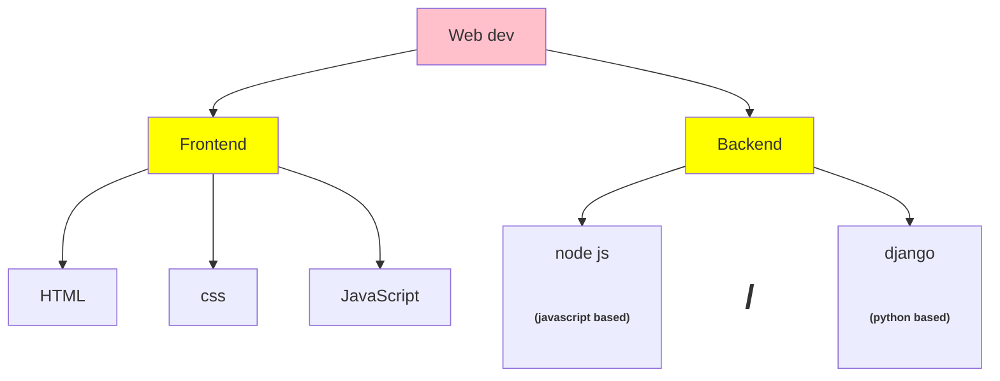

# Roadmaps-basics
Basic level learning tree of different job profile.

## 1. Data Anlyst
<ins> Basics roadmap of data science</ins>  <h4>
Step1 : [Learn Math](https://mml-book.github.io/) </h4>
**a. Statistics :** (mean, median, mode, variance, standard deviation, basics of graphs etc.)  
**b. Linear Algebra** (matrices, vectors, eigen values etc.)  
**c. Calculus** (limits, continuity, dy/dx etc.)  
**d. Probability** (distribution, bayes theorem etc.)  

**Step2 : Learn a Language (Python / R)**  
Python is recommended to learn.  
a. Learn basics (variables, if-else conditionals, loops)  
b. Learn numpy  
c. Learn pandas  

**Step3 : Learn Data Visualization**  
a. Learn Matplotlib/Seaborn  
b. Basics of Excel  
c. Some Advanced Tools : Tableau, Power BI  

**Step 4 : Learn Machine Learning**  
How to learn ML : [ML Roadmap](https://www.youtube.com/watch?v=1vsmaEfbnoE)

## 2. Full stack dev

## 3. Web dev

